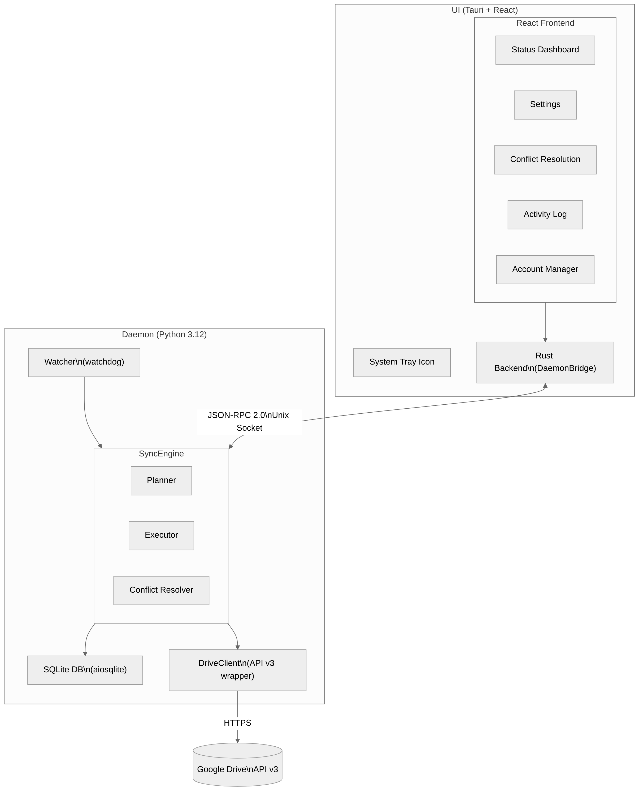
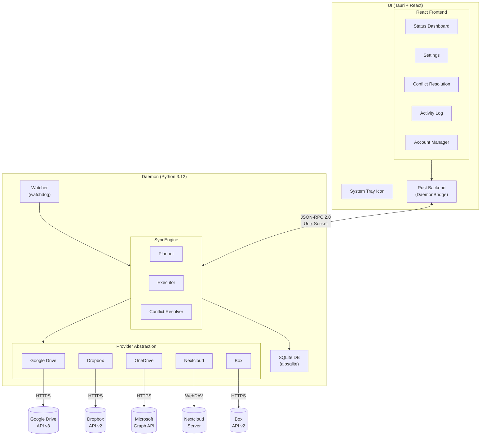
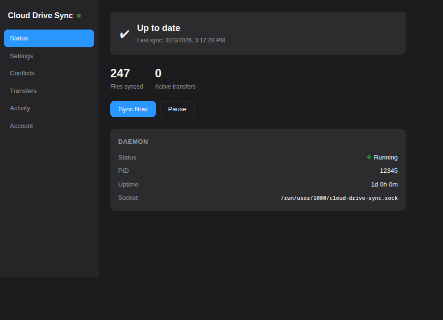
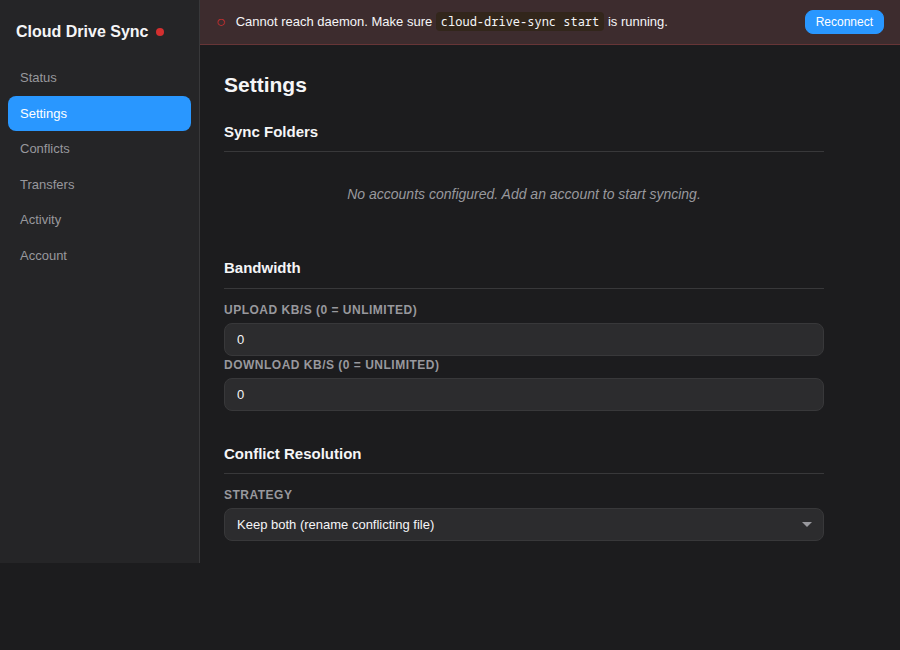
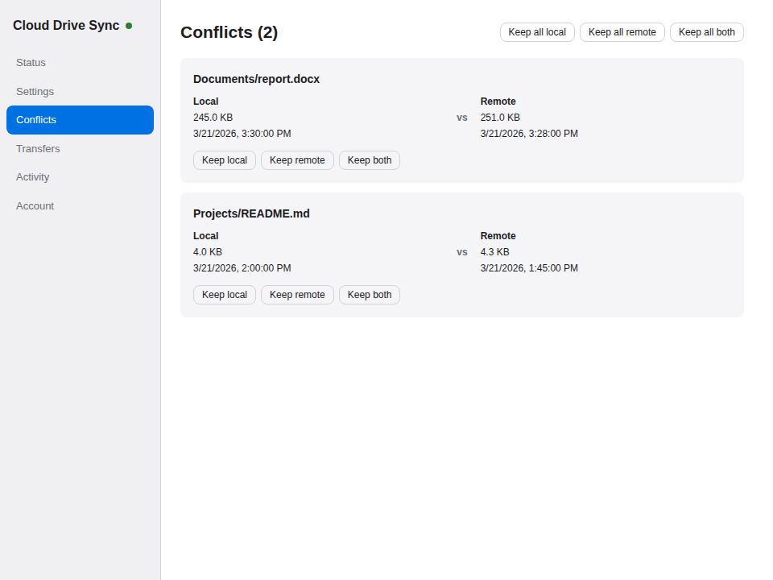
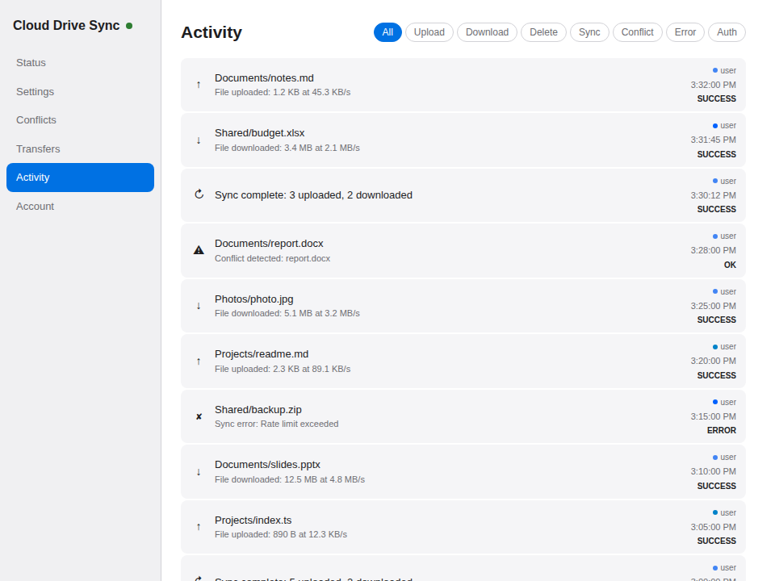
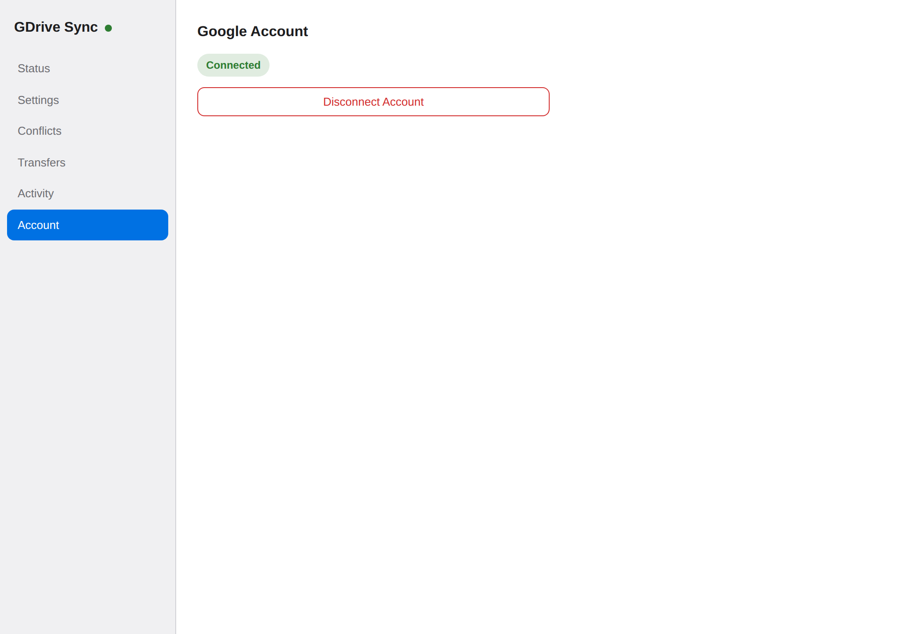

# Cloud Drive Sync

**There is no good, free Google Drive sync client for Linux.** The KDE Accounts integration barely works, GNOME Online Accounts only mounts files on demand (no offline access), and every other option is either paid (Insync), abandoned, or command-line only. We built Cloud Drive Sync to fix that — a native, open-source desktop app that just works, like what Dropbox and Google Drive offer on Windows and macOS but never bothered to ship for Linux.

It grew into a full multi-cloud sync platform supporting **Google Drive**, **Dropbox**, **OneDrive**, **Nextcloud**, and **Box**, running on **Linux, macOS, and Windows** — with Proton Drive planned for Q2 2026+.

<picture>
  <source media="(prefers-color-scheme: dark)" srcset="docs/screenshots/architecture.png">
  
</picture>

<details>
<summary>View as Mermaid</summary>



</details>

## Installation

Pre-built packages are available from the [latest release](https://github.com/ciberkids/cloud-drive-sync/releases/latest). Each package bundles both the desktop UI and the sync daemon — no separate install needed.

### Debian / Ubuntu / Mint (.deb)

```bash
# Download and install
wget https://github.com/ciberkids/cloud-drive-sync/releases/latest/download/Cloud.Drive.Sync_0.1.0_amd64.deb
sudo dpkg -i Cloud.Drive.Sync_0.1.0_amd64.deb
sudo apt-get install -f  # install any missing dependencies

# Enable the daemon to start on login
systemctl --user enable --now cloud-drive-sync-daemon

# Launch the UI
cloud-drive-sync-ui
```

### Fedora / RHEL / openSUSE (.rpm)

```bash
# Download and install
wget https://github.com/ciberkids/cloud-drive-sync/releases/latest/download/Cloud.Drive.Sync-0.1.0-1.x86_64.rpm
sudo rpm -U Cloud.Drive.Sync-0.1.0-1.x86_64.rpm

# Enable the daemon to start on login
systemctl --user enable --now cloud-drive-sync-daemon

# Launch the UI
cloud-drive-sync-ui
```

### AppImage (any distro)

No installation required — download and run:

```bash
wget https://github.com/ciberkids/cloud-drive-sync/releases/latest/download/Cloud.Drive.Sync_0.1.0_amd64.AppImage
chmod +x Cloud.Drive.Sync_0.1.0_amd64.AppImage
./Cloud.Drive.Sync_0.1.0_amd64.AppImage
```

The AppImage bundles the daemon and will auto-start it when no running daemon is detected.

### Flatpak

```bash
# Install from the release bundle
wget https://github.com/ciberkids/cloud-drive-sync/releases/latest/download/cloud-drive-sync.flatpak
flatpak install --user cloud-drive-sync.flatpak

# Run
flatpak run com.cloud_drive_sync.app
```

### Headless / Server (standalone daemon)

For servers or headless setups without a desktop UI:

```bash
# Download the standalone daemon binary
wget https://github.com/ciberkids/cloud-drive-sync/releases/latest/download/cloud-drive-sync-daemon
chmod +x cloud-drive-sync-daemon
sudo mv cloud-drive-sync-daemon /usr/local/bin/

# Start the daemon
cloud-drive-sync-daemon start --foreground

# Manage via CLI
cloud-drive-sync-daemon account add --provider gdrive
cloud-drive-sync-daemon pair add --local ~/Documents --remote root
cloud-drive-sync-daemon status
```

### macOS

```bash
# Download DMG from latest release
# Or via Homebrew (coming soon):
# brew install --cask cloud-drive-sync
```

### Windows

```bash
# Download installer from latest release
# Or via Scoop (coming soon):
# scoop install cloud-drive-sync
```

### Install script

An interactive installer that detects your distro and downloads the right package:

```bash
curl -fsSL https://raw.githubusercontent.com/ciberkids/cloud-drive-sync/main/install.sh | bash
```

---

## Features

- **Multi-cloud support** — Google Drive, Dropbox, OneDrive, Nextcloud, Box (Proton Drive coming soon)
- **Bidirectional sync** — uploads local changes and downloads remote changes automatically
- **Cross-cloud sync** — download from one provider and upload to another (see [Cross-Cloud Sync](#cross-cloud-sync))
- **Google Docs conversion** — exports Google Docs/Sheets/Slides to .docx/.xlsx/.pptx locally, re-uploads on edit
- **Conflict resolution** — three strategies: keep both copies, newest wins, or ask the user
- **Real-time monitoring** — local filesystem watcher (watchdog) + remote change polling
- **Desktop notifications** — native OS notifications for sync events, conflicts, and errors
- **System tray** — always-on tray icon with dynamic status indicators (idle, syncing, error, conflict)
- **Headless CLI** — full management via command line without the GUI
- **Selective sync** — per-pair ignore patterns and `.cloud-drive-sync-ignore` files (gitignore-style)
- **Shared Drives** — full support for Google Workspace Shared Drives (Team Drives)
- **Multiple accounts** — connect accounts from different providers, bind each sync pair to a specific account
- **Hidden file filtering** — exclude dotfiles and dot-directories from sync (configurable per pair)
- **Multi-pair support** — sync multiple local folders to different cloud locations
- **Cross-platform** — runs natively on Linux, macOS, and Windows
- **Native desktop UI** — Tauri + React app for configuration and monitoring
- **Daemon architecture** — runs as a background service (systemd on Linux, sidecar on macOS/Windows)
- **XDG compliance** — config, data, and runtime files follow the XDG Base Directory spec
- **Encrypted credentials** — OAuth2 tokens stored encrypted on disk (per-account)
- **Demo mode** — test the full UI and sync flow without any cloud account

## Supported Providers

| Provider | Status | Auth Method | Hash Algorithm | Notes |
|----------|--------|-------------|----------------|-------|
| Google Drive | Available | OAuth 2.0 (browser) | MD5 | Shared Drives, Google Docs conversion |
| Dropbox | Optional dep | OAuth 2.0 PKCE | Content hash (SHA-256 blocks) | Path-based API, cursor-based changes |
| OneDrive | Optional dep | Azure AD (device code / browser) | QuickXorHash | Microsoft Graph API, delta sync |
| Nextcloud | Optional dep | App password | MD5 | Self-hosted, WebDAV, ETag polling |
| Box | Optional dep | OAuth 2.0 | SHA-1 | Chunked upload >50MB, Events API |
| Proton Drive | Planned Q2 2026+ | N/A | N/A | No public API yet |

### Installing provider dependencies

Google Drive support is included by default. For other providers, install their optional dependencies:

```bash
# Individual providers
pip install cloud-drive-sync[dropbox]
pip install cloud-drive-sync[onedrive]
pip install cloud-drive-sync[nextcloud]
pip install cloud-drive-sync[box]

# All providers at once
pip install cloud-drive-sync[all-providers]
```

## Screenshots

> Screenshots show the Tauri desktop application.

### Status Dashboard



### Settings



### Conflicts



### Activity Log



### Account Manager



> To add screenshots, place PNG files in `docs/screenshots/` matching the filenames above.

## Quick Start (Demo Mode)

```bash
# Clone and start everything in demo mode (no cloud account needed)
git clone https://github.com/ciberkids/cloud-drive-sync.git
cd cloud-drive-sync
./dev.sh              # daemon only
./dev.sh --with-ui    # daemon + Tauri UI
```

## Prerequisites

### Daemon only

- **Python 3.12+**

### UI (optional)

- **Node.js 18+** and **npm**
- **Rust toolchain** — install via [rustup](https://rustup.rs)
- **System libraries** for Tauri:

  | Distro | Packages |
  |--------|----------|
  | Fedora | `webkit2gtk4.1-devel gtk3-devel libayatana-appindicator-gtk3-devel` |
  | Ubuntu/Debian | `libwebkit2gtk-4.1-dev libgtk-3-dev libayatana-appindicator3-dev` |
  | Arch | `webkit2gtk-4.1 gtk3 libayatana-appindicator` |

## Provider Setup

Each cloud provider requires its own credentials or app registration. Below are the setup instructions for each.

### Google Drive

Works out of the box — OAuth client credentials are embedded in the app. Just click **Add Account** in the UI or run:

```bash
cloud-drive-sync-daemon account add --provider gdrive
```

A browser window will open for Google sign-in. No setup required.

> **Power users:** To use your own OAuth credentials, place a `client_secret.json` in `~/.config/cloud-drive-sync/` or set `CDS_GOOGLE_CLIENT_ID` and `CDS_GOOGLE_CLIENT_SECRET` environment variables.

### Dropbox (OAuth 2.0 PKCE)

Dropbox uses OAuth 2.0 with PKCE — no client secret is required.

1. Go to the [Dropbox App Console](https://www.dropbox.com/developers/apps)
2. Click **Create app**
3. Choose **Scoped access** -> **Full Dropbox** (or App folder for limited access)
4. Name your app (e.g. `cloud-drive-sync`)
5. In the app settings, note the **App key** (you'll need it during auth)
6. Under **OAuth 2**, add `http://localhost` to redirect URIs
7. Under **Permissions**, enable: `files.metadata.read`, `files.metadata.write`, `files.content.read`, `files.content.write`

When adding a Dropbox account via CLI (`cloud-drive-sync account add --provider dropbox`), you'll be prompted for the App key and directed to authorize in your browser.

### OneDrive (Azure AD App Registration)

OneDrive uses the Microsoft Graph API with Azure AD authentication.

1. Go to the [Azure Portal - App registrations](https://portal.azure.com/#view/Microsoft_AAD_RegisteredApps/ApplicationsListBlade)
2. Click **New registration**
3. Name: `cloud-drive-sync`, Supported account types: **Personal Microsoft accounts + organizational**
4. Redirect URI: **Public client/native** -> `http://localhost:8400`
5. Note the **Application (client) ID**
6. Under **API permissions**, add: `Microsoft Graph` -> `Files.ReadWrite.All`, `User.Read`
7. Grant admin consent (or users will be prompted)

For headless setups, the device code flow is used — no browser needed on the server itself.

### Nextcloud (App Password)

Nextcloud uses app passwords for authentication — no OAuth app registration needed.

1. Log in to your Nextcloud instance
2. Go to **Settings** -> **Security** -> **Devices & sessions**
3. Enter a name (e.g. `cloud-drive-sync`) and click **Create new app password**
4. Copy the generated password

When adding a Nextcloud account, you'll provide:
- **Server URL**: your Nextcloud instance (e.g. `https://cloud.example.com`)
- **Username**: your Nextcloud username
- **App password**: the generated password

```bash
cloud-drive-sync account add --provider nextcloud
# Enter server URL, username, and app password when prompted
```

### Box (OAuth 2.0)

Box uses standard OAuth 2.0 with a client secret.

1. Go to the [Box Developer Console](https://app.box.com/developers/console)
2. Click **Create New App** -> **Custom App** -> **User Authentication (OAuth 2.0)**
3. Name your app (e.g. `cloud-drive-sync`)
4. In the app configuration, note the **Client ID** and **Client Secret**
5. Under **OAuth 2.0 Redirect URI**, add `http://localhost:8400`
6. Under **Application Scopes**, enable: Read/Write all files and folders

Set environment variables or provide credentials when prompted:
```bash
export BOX_CLIENT_ID="your_client_id"
export BOX_CLIENT_SECRET="your_client_secret"
cloud-drive-sync account add --provider box
```

---

## Cross-Cloud Sync

Cloud Drive Sync can be used to sync files **between different cloud providers** by setting up two sync pairs that point to the same local directory — one in download-only mode and another in upload-only mode.

### Example: Google Drive -> Dropbox

Sync files from Google Drive to Dropbox automatically:

```bash
# 1. Add both accounts
cloud-drive-sync account add --provider gdrive
cloud-drive-sync account add --provider dropbox

# 2. Create a shared local directory
mkdir -p ~/cloud-bridge

# 3. Add a download-only pair from Google Drive
cloud-drive-sync pair add \
  --local ~/cloud-bridge \
  --remote root \
  --account user@gmail.com \
  --provider gdrive

# Set it to download-only (Google Drive -> local)
# Use the UI Settings or edit config.toml:
#   sync_mode = "download_only"

# 4. Add an upload-only pair to Dropbox
cloud-drive-sync pair add \
  --local ~/cloud-bridge \
  --remote "" \
  --account user@dropbox.com \
  --provider dropbox

# Set it to upload-only (local -> Dropbox)
#   sync_mode = "upload_only"
```

Or via `config.toml`:

```toml
[[sync.pairs]]
local_path = "/home/user/cloud-bridge"
remote_folder_id = "root"
sync_mode = "download_only"      # Google Drive -> local
account_id = "user@gmail.com"
provider = "gdrive"

[[sync.pairs]]
local_path = "/home/user/cloud-bridge"
remote_folder_id = ""
sync_mode = "upload_only"        # local -> Dropbox
account_id = "user@dropbox.com"
provider = "dropbox"

[[accounts]]
email = "user@gmail.com"
provider = "gdrive"

[[accounts]]
email = "user@dropbox.com"
provider = "dropbox"
```

### Other cross-cloud scenarios

The same pattern works for any combination:

| Source | Destination | Source sync_mode | Dest sync_mode |
|--------|------------|-----------------|---------------|
| Google Drive | Dropbox | `download_only` | `upload_only` |
| OneDrive | Nextcloud | `download_only` | `upload_only` |
| Box | Google Drive | `download_only` | `upload_only` |
| Any | Any | `download_only` | `upload_only` |

For **bidirectional** cross-cloud sync (changes on either side are reflected on both), use `two_way` for both pairs. Be aware this may cause sync loops if both providers modify the same file simultaneously — the conflict resolver will handle these cases.

## Manual Installation (from source)

### 1. Clone the repository

```bash
git clone https://github.com/ciberkids/cloud-drive-sync.git
cd cloud-drive-sync
```

### 2. Install the daemon

```bash
cd daemon

# Create a virtual environment
python3 -m venv .venv

# Install the daemon (Google Drive only)
.venv/bin/pip install -e .

# Install with all cloud providers
.venv/bin/pip install -e ".[all-providers]"

# (Optional) Install dev/test dependencies too
.venv/bin/pip install -e ".[dev]"
```

Verify the installation:

```bash
.venv/bin/python -m cloud_drive_sync --help
```

### 3. Install the UI

```bash
cd ui

# Install JavaScript dependencies
npm install

# (Optional) Verify Tauri compiles
npm run tauri build
```

The compiled binary will be at `ui/src-tauri/target/release/cloud-drive-sync-ui`.

## Running

### Start the daemon

The daemon must be running before the UI can connect to it.

```bash
cd daemon

# Foreground (see logs in terminal)
.venv/bin/python -m cloud_drive_sync --log-level debug start --foreground

# Background (daemonize)
.venv/bin/python -m cloud_drive_sync start

# Check status
.venv/bin/python -m cloud_drive_sync status

# Stop
.venv/bin/python -m cloud_drive_sync stop
```

On first launch without existing credentials, the daemon starts and waits for authentication. Connect via the UI and click **Add Account** on the Account page, or use the CLI.

### Headless CLI

Manage everything from the command line without the GUI:

```bash
# Account management
cloud-drive-sync account add --provider gdrive
cloud-drive-sync account add --provider dropbox
cloud-drive-sync account list
cloud-drive-sync account remove user@gmail.com

# Sync pair management
cloud-drive-sync pair add --local ~/Documents --remote root --account user@gmail.com
cloud-drive-sync pair list
cloud-drive-sync pair remove 0

# Sync control
cloud-drive-sync sync                    # Trigger immediate sync (all pairs)
cloud-drive-sync sync --pair-id pair_0   # Sync specific pair
cloud-drive-sync pause
cloud-drive-sync resume

# Monitoring
cloud-drive-sync activity --limit 20
cloud-drive-sync conflicts
cloud-drive-sync resolve 1 keep_both
```

### Start the UI

In a separate terminal:

```bash
cd ui

# Development mode (hot-reload)
npm run tauri dev

# Or run a release build directly
./src-tauri/target/release/cloud-drive-sync-ui
```

The UI connects to the daemon via a Unix socket at `$XDG_RUNTIME_DIR/cloud-drive-sync.sock` (typically `/run/user/1000/cloud-drive-sync.sock`).

### Run as a systemd service

To start the daemon automatically on login:

```bash
# Install the service
mkdir -p ~/.config/systemd/user
cp installer/cloud-drive-sync-daemon.service ~/.config/systemd/user/
systemctl --user daemon-reload
systemctl --user enable --now cloud-drive-sync-daemon

# Check logs
journalctl --user -u cloud-drive-sync-daemon -f

# Uninstall
systemctl --user disable --now cloud-drive-sync-daemon
rm ~/.config/systemd/user/cloud-drive-sync-daemon.service
systemctl --user daemon-reload
```

**Note:** The systemd service expects the daemon binary at `~/.local/bin/cloud-drive-sync-daemon`. You can create a wrapper script:

```bash
cat > ~/.local/bin/cloud-drive-sync-daemon << 'EOF'
#!/bin/sh
exec /path/to/cloud-drive-sync/daemon/.venv/bin/python -m cloud_drive_sync "$@"
EOF
chmod +x ~/.local/bin/cloud-drive-sync-daemon
```

## Configuration

The daemon reads `~/.config/cloud-drive-sync/config.toml` (created automatically on first run):

```toml
[general]
log_level = "info"

[sync]
poll_interval = 30
conflict_strategy = "keep_both"
max_concurrent_transfers = 4
debounce_delay = 1.0
convert_google_docs = true
notify_sync_complete = true
notify_conflicts = true
notify_errors = true

[[sync.pairs]]
local_path = "/home/user/Documents"
remote_folder_id = "root"
enabled = true
sync_mode = "two_way"
ignore_hidden = true
ignore_patterns = ["*.tmp", "node_modules", "build/"]
account_id = "user@gmail.com"
provider = "gdrive"

[[accounts]]
email = "user@gmail.com"
display_name = "user@gmail.com"
provider = "gdrive"
```

You can also configure sync pairs through the UI Settings page.

### Selective sync (ignore patterns)

Exclude files and folders from sync using glob patterns. There are two ways to set them:

**Per-pair config** — add `ignore_patterns` to a sync pair in `config.toml` (or use the "Ignore Patterns" button in the UI Settings):

```toml
[[sync.pairs]]
local_path = "/home/user/Projects"
ignore_patterns = ["*.log", "node_modules", "dist/", "__pycache__"]
```

**Per-folder file** — create a `.cloud-drive-sync-ignore` file in any synced folder root (gitignore-style, one pattern per line):

```
# Build artifacts
build/
dist/
*.o

# Logs
*.log

# IDE files
.idea/
.vscode/
```

Patterns from the config, the ignore file, and built-in defaults (`.git`, `__pycache__`, `.DS_Store`, etc.) are all merged together.

### Multiple accounts

Add accounts from any supported provider via the UI Account Manager or CLI. Each sync pair can be bound to a specific account. On first upgrade from single-account to multi-account, existing Google credentials are automatically migrated.

### Shared Drives

Google Shared Drives (Team Drives) are automatically available. When browsing remote folders in the UI, Shared Drives appear as a separate section at the root level. All sync operations (upload, download, polling) work with Shared Drive files.

### Google Docs conversion

By default, Google Docs, Sheets, and Slides are exported to local .docx, .xlsx, and .pptx files respectively. When you edit the local file, it is re-uploaded with conversion back to the native format.

To disable this behavior:

```toml
[sync]
convert_google_docs = false
```

### Desktop notifications

Native OS notifications are sent for sync events. Configure which notifications to show:

```toml
[sync]
notify_sync_complete = true   # "Sync complete: X uploaded, Y downloaded"
notify_conflicts = true       # "Conflict: filename.txt"
notify_errors = true          # "Sync error: ..."
```

See [daemon/README.md](daemon/README.md) for the full configuration reference.

## Testing

```bash
cd daemon

# Run all tests
.venv/bin/pytest -v

# Run integration tests only (uses demo mode, no cloud credentials)
.venv/bin/pytest -v -m integration
```

## Project Structure

```
cloud-drive-sync/
├── daemon/              # Python sync daemon
│   ├── src/cloud_drive_sync/ # Source code
│   │   ├── providers/   # Cloud provider implementations
│   │   │   ├── base.py  # Abstract base classes
│   │   │   ├── registry.py # Provider registry
│   │   │   ├── gdrive/  # Google Drive
│   │   │   ├── dropbox/ # Dropbox
│   │   │   ├── onedrive/ # OneDrive
│   │   │   ├── nextcloud/ # Nextcloud
│   │   │   ├── box/     # Box
│   │   │   └── proton/  # Proton Drive (stub)
│   │   ├── sync/        # Planner, executor, engine
│   │   ├── drive/       # Legacy shims (re-exports from providers/gdrive/)
│   │   ├── ipc/         # JSON-RPC server + CLI client
│   │   ├── db/          # SQLite database
│   │   ├── local/       # File scanner, watcher, hasher
│   │   └── auth/        # Google OAuth (legacy, used by providers/gdrive/)
│   └── tests/           # pytest test suite (430+ tests)
├── ui/                  # Tauri + React desktop UI
│   ├── src/             # React components
│   └── src-tauri/       # Rust backend
├── docs/                # Documentation
├── installer/           # systemd service, .desktop files, icons
├── Makefile             # Build and dev commands
└── dev.sh               # One-liner dev setup
```

## Documentation

- [CLI Reference](docs/CLI.md) — complete command-line interface guide with examples
- [Architecture](docs/ARCHITECTURE.md) — system design, sync algorithm, database schema
- [API Reference](docs/API.md) — full IPC method documentation with examples
- [Daemon](docs/DAEMON.md) — daemon CLI, config reference, demo mode
- [UI](docs/UI.md) — Tauri development and build instructions
- [Contributing](docs/CONTRIBUTING.md) — dev setup, code style, PR process

## License

MIT
