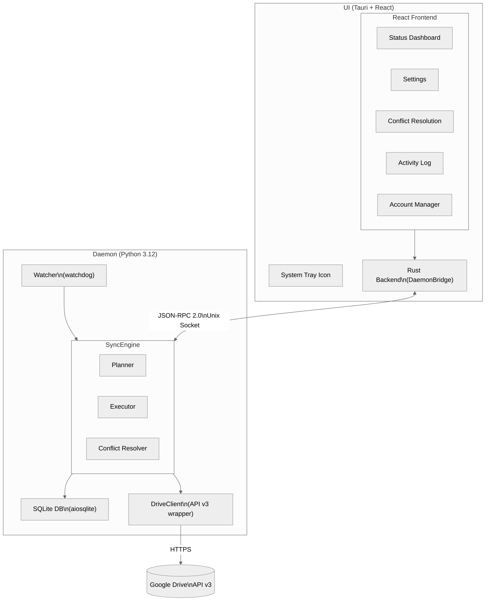
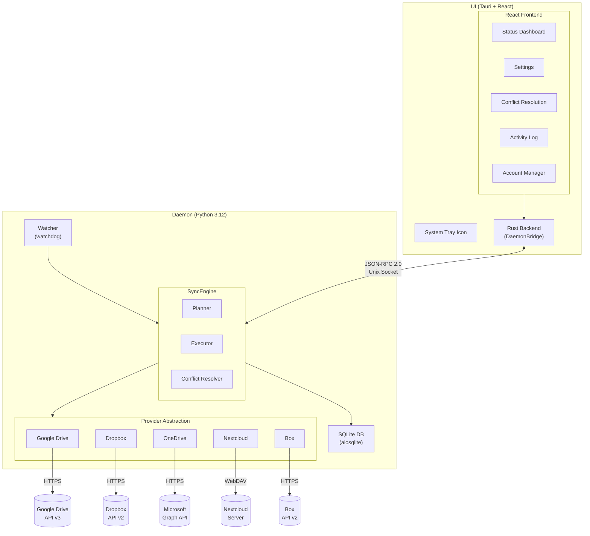
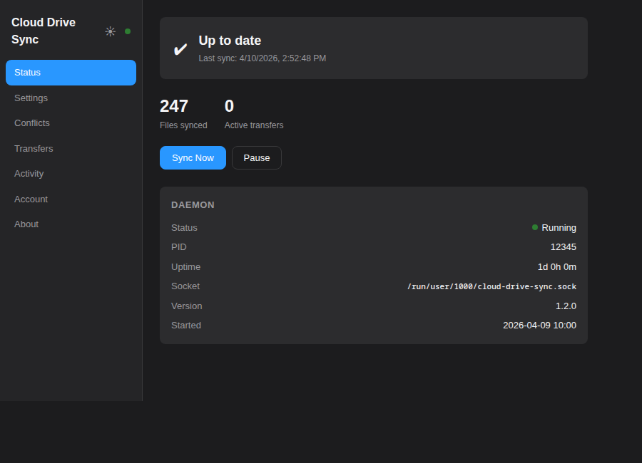
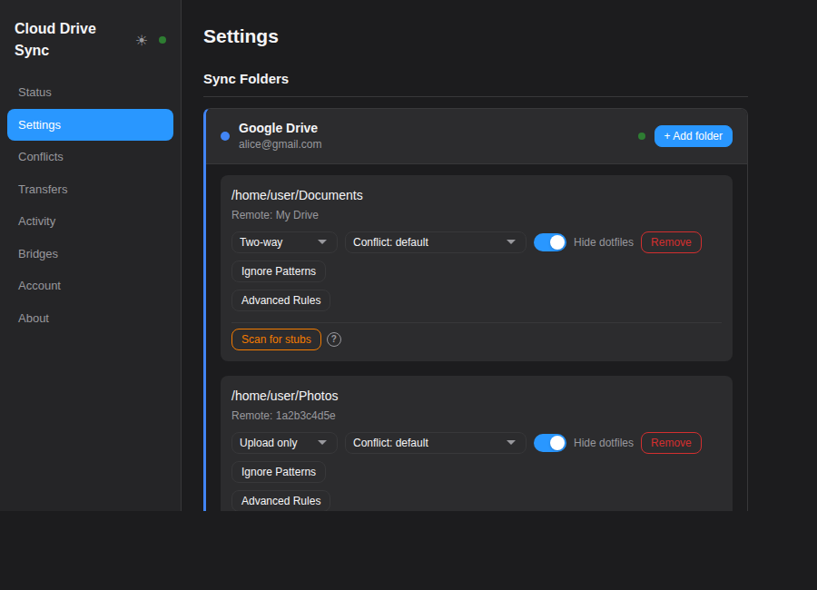
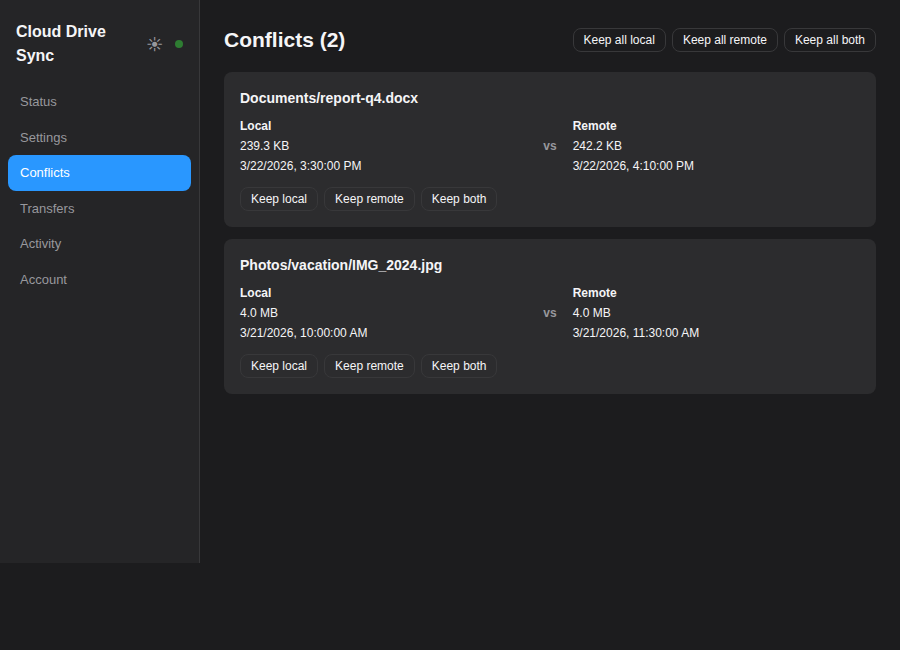
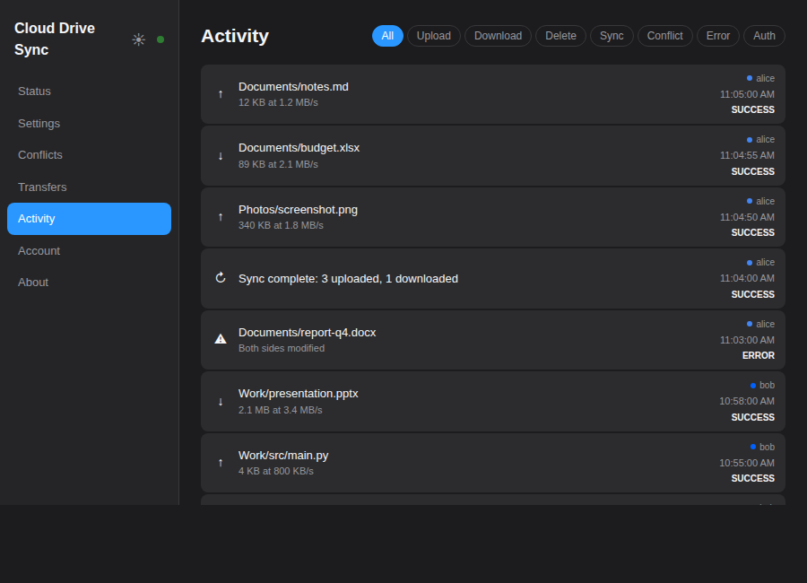
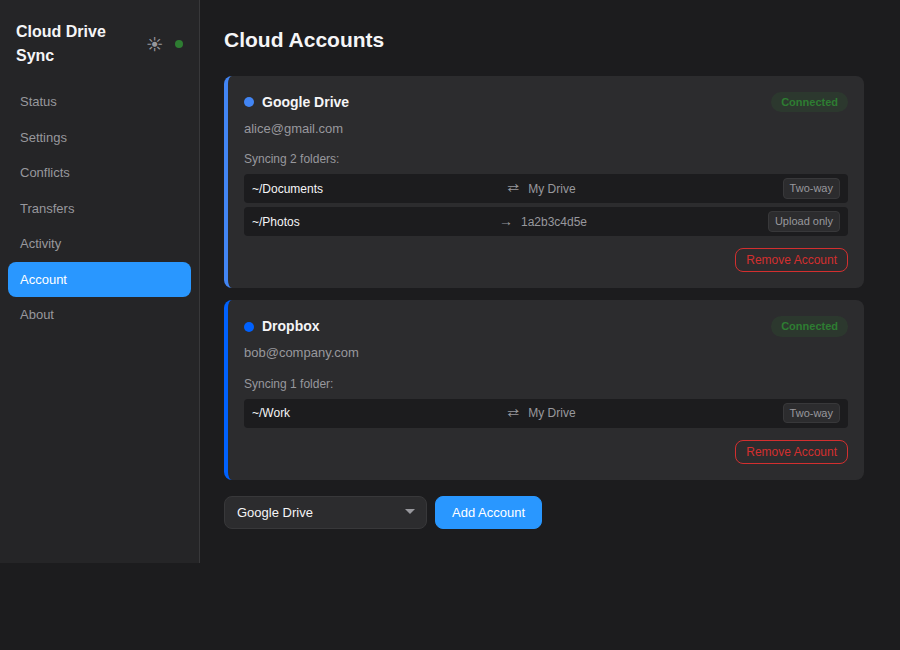

# Cloud Drive Sync

**There is no good, free Google Drive sync client for Linux.** The KDE Accounts integration barely works, GNOME Online Accounts only mounts files on demand (no offline access), and every other option is either paid (Insync), abandoned, or command-line only. We built Cloud Drive Sync to fix that — a native, open-source desktop app that just works, like what Dropbox and Google Drive offer on Windows and macOS but never bothered to ship for Linux.

It grew into a full multi-cloud sync platform supporting **Google Drive**, **Dropbox**, **OneDrive**, **Nextcloud**, and **Box**, running on **Linux, macOS, and Windows** — with Proton Drive planned for Q2 2026+.

If this project is useful to you, consider supporting it:

<a href="https://buymeacoffee.com/ciberkids"></a>

<picture>
  <source media="(prefers-color-scheme: dark)" srcset="docs/screenshots/architecture.png">
  
</picture>

<details>
<summary>View as Mermaid</summary>


```mermaid
graph TB
    subgraph UI["UI (Tauri + React)"]
        direction TB
        subgraph Frontend["React Frontend"]
            StatusDashboard["Status Dashboard"]
            Settings
            ConflictDialog["Conflict Resolution"]
            ActivityLog["Activity Log"]
            AccountManager["Account Manager"]
        end
        Tray["System Tray Icon"]
        RustBackend["Rust Backend\n(DaemonBridge)"]
        Frontend --> RustBackend
    end

    subgraph Daemon["Daemon (Python 3.12)"]
        direction TB
        subgraph SyncEngine
            Planner
            Executor
            ConflictResolver["Conflict Resolver"]
        end
        subgraph Providers["Provider Abstraction"]
            GDrive["Google Drive"]
            Dropbox["Dropbox"]
            OneDrive["OneDrive"]
            Nextcloud["Nextcloud"]
            Box["Box"]
        end
        Watcher["Watcher\n(watchdog)"]
        DB["SQLite DB\n(aiosqlite)"]
        Watcher --> SyncEngine
        SyncEngine --> DB
        SyncEngine --> Providers
    end

    RustBackend <-->|"JSON-RPC 2.0\nUnix Socket"| SyncEngine
    GDrive -->|"HTTPS"| GoogleAPI[("Google Drive\nAPI v3")]
    Dropbox -->|"HTTPS"| DropboxAPI[("Dropbox\nAPI v2")]
    OneDrive -->|"HTTPS"| GraphAPI[("Microsoft\nGraph API")]
    Nextcloud -->|"WebDAV"| NextcloudAPI[("Nextcloud\nServer")]
    Box -->|"HTTPS"| BoxAPI[("Box\nAPI v2")]
```

</details>

## How It Works

Cloud Drive Sync runs in two modes:

| Mode | Description |
|------|-------------|
| **Desktop Mode** | Native desktop app (Tauri + React) with system tray, desktop notifications, and visual management of accounts, sync folders, and conflicts. Works on Linux, macOS, and Windows. |
| **Headless Mode** | Daemon runs standalone — ideal for servers, NAS devices, and Docker containers. Manage via CLI (`cloud-drive-sync status`), Web UI (`http://localhost:8080/`), REST API (`curl http://localhost:8080/api/status`), or an AI assistant over [MCP](https://modelcontextprotocol.io). |

The HTTP server (web UI + REST API) starts with `--http-port 8080`. Docker containers enable it by default. Headless does not mean CLI-only — the daemon serves the same web UI as the desktop app from its own process, with no separate web server to run.

An **MCP server** for AI assistants (Claude Desktop, Claude Code, any MCP client) starts with `--mcp-port 8081`, or `CDS_MCP_PORT=8081` in a container. It is off by default and read-only unless you add `--mcp-allow-writes`, so an assistant can answer "is sync healthy?" or "why hasn't this file uploaded?" without being able to change anything. See [MCP Server](https://github.com/ciberkids/cloud-drive-sync/wiki/Daemon#mcp-server-for-ai-assistants).

> 🔑 A **new install** generates a web UI access token on first start and prints it to the log. An install that already has a config file is left as it was, so an upgrade cannot lock you out — it stays unauthenticated until you set `--http-token` / `CDS_HTTP_TOKEN` or `[http] token`.
>
> ⚠️ The **MCP endpoint** is always unauthenticated unless you set `--mcp-token` / `CDS_MCP_TOKEN`. Both ports bind all interfaces. If you publish either, read [Authentication](https://github.com/ciberkids/cloud-drive-sync/wiki/Daemon#authentication) first.

**What's next:** the ordered [Feature Queue](https://github.com/ciberkids/cloud-drive-sync/wiki/ROADMAP) lists what is being built and in what order — currently a delete fail-safe, an emergency stop control, and a spike on replacing the Nextcloud WebDAV bridge.

Authentication in headless mode works without a local browser — the daemon prints an authorization URL to the console, and you complete sign-in on any device.

---

## Features

- **Multi-cloud support** — Google Drive, Dropbox, OneDrive, Nextcloud, Box (Proton Drive coming soon)
- **Bidirectional sync** — uploads local changes and downloads remote changes automatically
- **Cross-cloud sync** — download from one provider and upload to another (see [Cross-Cloud Sync](https://github.com/ciberkids/cloud-drive-sync/wiki/Cross-Cloud-Sync))
- **Google Docs conversion** — exports Google Docs/Sheets/Slides to .docx/.xlsx/.pptx locally, re-uploads on edit
- **Conflict resolution** — three strategies: keep both copies, newest wins, or ask the user
- **Real-time monitoring** — local filesystem watcher (watchdog) + remote change polling
- **Desktop notifications** — native OS notifications for sync events, conflicts, and errors
- **Event webhooks** — POST sync events to your own endpoint, configurable globally or per pair, with Basic/bearer/custom auth and HMAC signing (see [Webhooks](https://github.com/ciberkids/cloud-drive-sync/wiki/Daemon#webhooks))
- **System tray** — always-on tray icon with dynamic status indicators (idle, syncing, error, conflict)
- **Headless CLI** — full management via command line without the GUI
- **Selective sync** — per-pair ignore patterns and `.cloud-drive-sync-ignore` files (gitignore-style)
- **Shared Drives** — full support for Google Workspace Shared Drives (Team Drives)
- **Multiple accounts** — connect accounts from different providers, bind each sync pair to a specific account
- **Hidden file filtering** — exclude dotfiles and dot-directories from sync (configurable per pair)
- **Multi-pair support** — sync multiple local folders to different cloud locations
- **Cross-platform** — runs natively on Linux, macOS, and Windows
- **Native desktop UI** — Tauri + React app for configuration and monitoring
- **Daemon architecture** — runs as a background service (systemd on Linux, sidecar on macOS/Windows)
- **XDG compliance** — config, data, and runtime files follow the XDG Base Directory spec
- **Encrypted credentials** — every provider's tokens are encrypted at rest (Fernet, key derived from a machine identifier) and stored per-account, owner-readable only (`0600`). Files written by older versions are upgraded automatically the first time they are read
- **Demo mode** — test the full UI and sync flow without any cloud account

---

## Supported Providers

| Provider | Status | Auth Method | Hash Algorithm | Notes |
|----------|--------|-------------|----------------|-------|
| Google Drive | ✅ Tested | OAuth 2.0 (browser) | MD5 | Shared Drives, Google Docs conversion |
| Nextcloud | ✅ Tested | App password | MD5 | Self-hosted, WebDAV, ETag polling |
| Dropbox | 🧪 Needs testing | OAuth 2.0 PKCE | Content hash (SHA-256 blocks) | Chunked upload covered by tests; no live-account validation |
| OneDrive | 🧪 Needs testing | Azure AD (device code / browser) | QuickXorHash | Chunked upload covered by tests; no live-account validation |
| Box | 🧪 Needs testing | OAuth 2.0 | SHA-1 | Chunked upload covered by tests; no live-account validation |
| Proton Drive | 🔜 Planned Q2 2026+ | N/A | N/A | No public API yet |

> **Tested** means we actively run it in production and bugs are caught quickly.
> **Needs testing** means the provider implementation is complete but has not been validated end-to-end by the maintainers.
> The status is deliberately unchanged by the upload tests added in v2.4.0: those cover the chunking and offset arithmetic against fake SDKs, which is not the same as having run a sync against a real Dropbox, OneDrive, or Box account.
> If you use Dropbox, OneDrive, or Box — please try it and [open an issue](https://github.com/ciberkids/cloud-drive-sync/issues) if anything breaks. Your reports directly improve coverage for everyone.

**Pre-built packages (DEB, RPM, AppImage, Flatpak, DMG, MSI) and the Docker image include all providers out of the box** — no extra steps needed. If you install from PyPI, providers other than Google Drive require optional dependencies:

```bash
pip install cloud-drive-sync[nextcloud]      # includes nc-py-api
pip install cloud-drive-sync[dropbox]        # includes dropbox SDK
pip install cloud-drive-sync[onedrive]       # includes msgraph-sdk + azure-identity
pip install cloud-drive-sync[box]            # includes box-sdk-gen
pip install cloud-drive-sync[all-providers]  # everything at once
```

---

## Screenshots

> Screenshots show the Tauri desktop application.

### Status Dashboard



### Settings



### Conflicts



### Activity Log



### Account Manager



> To add screenshots, place PNG files in `docs/screenshots/` matching the filenames above.

---

## Getting Started

| Guide | Link |
|-------|------|
| Install on Linux / macOS / Windows | [Installation](https://github.com/ciberkids/cloud-drive-sync/wiki/Installation) |
| Run with Docker | [Docker](https://github.com/ciberkids/cloud-drive-sync/wiki/Docker) |
| Run with Podman Quadlet (servers / NAS) | [Quadlet](https://github.com/ciberkids/cloud-drive-sync/wiki/Quadlet) |
| Provider Setup (OAuth, credentials) | [Provider Setup](https://github.com/ciberkids/cloud-drive-sync/wiki/Provider-Setup) |
| Configuration Reference | [Configuration](https://github.com/ciberkids/cloud-drive-sync/wiki/Configuration) |
| Cross-Cloud Sync | [Cross-Cloud Sync](https://github.com/ciberkids/cloud-drive-sync/wiki/Cross-Cloud-Sync) |
| CLI Reference | [CLI](https://github.com/ciberkids/cloud-drive-sync/wiki/CLI) |

---

## Documentation

- [CLI Reference](docs/CLI.md) — complete command-line interface guide with examples
- [Architecture](docs/ARCHITECTURE.md) — system design, sync algorithm, database schema
- [API Reference](docs/API.md) — full IPC method documentation with examples
- [Daemon](docs/DAEMON.md) — daemon CLI, config reference, demo mode
- [UI](docs/UI.md) — Tauri development and build instructions
- [Contributing](docs/CONTRIBUTING.md) — dev setup, code style, PR process

---

## License

MIT
