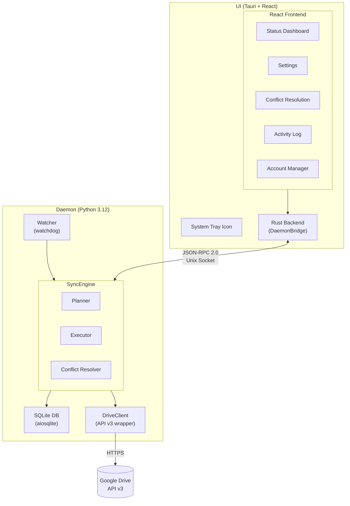
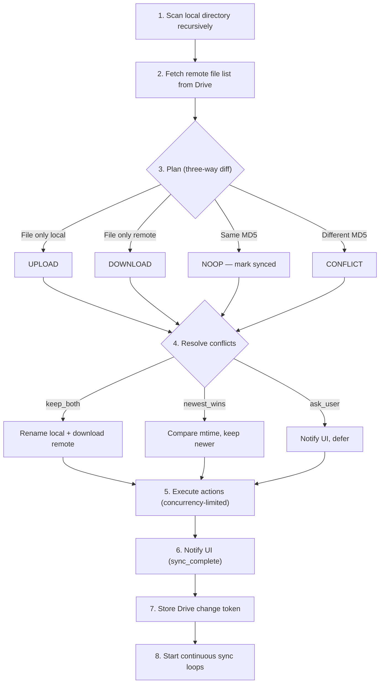
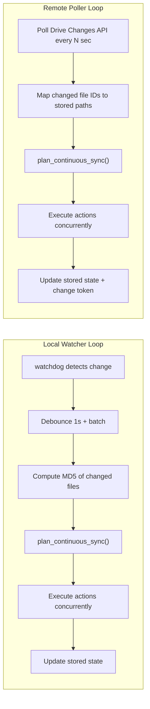
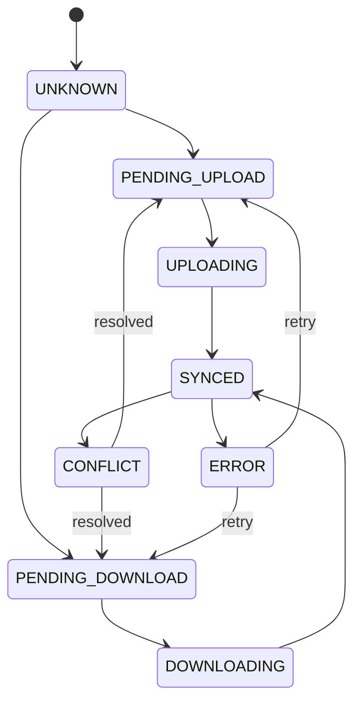
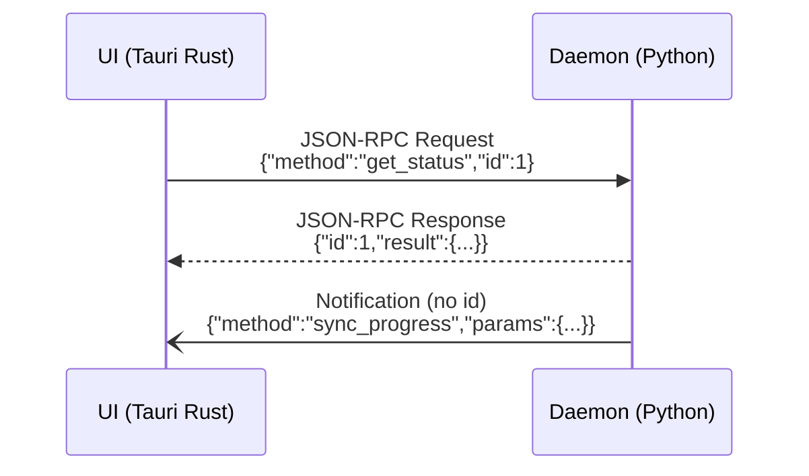

# Architecture

Cloud Drive Sync is a two-process system: a Python daemon that performs all sync operations, and a Tauri/React desktop UI that communicates with the daemon over a Unix domain socket.

## System Overview

## Component Breakdown

### Daemon (`daemon/`)

The daemon is a Python asyncio application that runs as a background service.

| Component | Module | Responsibility |
|---|---|---|
| **SyncEngine** | `sync/engine.py` | Top-level orchestrator. Manages pair lifecycles, wires watcher + poller + planner + executor. |
| **SyncPlanner** | `sync/planner.py` | Diffs local vs remote state and produces `SyncAction` lists (upload, download, delete, conflict, noop). |
| **SyncExecutor** | `sync/executor.py` | Executes planned actions with a concurrency-limited semaphore. |
| **ConflictResolver** | `sync/conflict.py` | Three-way conflict detection and resolution (keep_both, newest_wins, ask_user). |
| **DriveClient** | `drive/client.py` | Thin async wrapper around Google Drive API v3. All calls run in a thread pool via `asyncio.to_thread`. |
| **FileOperations** | `drive/operations.py` | Higher-level upload/download/delete with resumable transfers and progress callbacks. |
| **ChangePoller** | `drive/changes.py` | Polls the Drive Changes API for remote modifications. |
| **DirectoryWatcher** | `local/watcher.py` | Uses watchdog to detect local filesystem changes with debounced event coalescing. |
| **Database** | `db/database.py` | Async SQLite wrapper (aiosqlite) for sync state, conflicts, activity log, and change tokens. |
| **IpcServer** | `ipc/server.py` | Unix domain socket server accepting JSON-RPC 2.0 requests. Newline-delimited. |
| **RequestHandler** | `ipc/handlers.py` | Dispatches JSON-RPC methods to handler functions. |
| **Config** | `config.py` | Loads and saves TOML configuration. |
| **Daemon** | `daemon.py` | Main process class — initializes all components, handles signals, manages PID file. |

### UI (`ui/`)

The UI is a Tauri v2 application with a React frontend and Rust backend.

| Component | File | Responsibility |
|---|---|---|
| **DaemonBridge** | `src-tauri/src/ipc_bridge.rs` | Rust client that connects to the daemon's Unix socket. |
| **Tauri Commands** | `src-tauri/src/commands.rs` | Tauri invoke handlers that proxy calls through the bridge. |
| **System Tray** | `src-tauri/src/tray.rs` | Tray icon with status indicators and context menu. |
| **SyncStatus** | `src/components/SyncStatus.tsx` | Status dashboard with sync controls. |
| **Settings** | `src/components/Settings.tsx` | Sync pair management and conflict strategy. |
| **ConflictDialog** | `src/components/ConflictDialog.tsx` | Conflict list with per-file and batch resolution. |
| **ActivityLog** | `src/components/ActivityLog.tsx` | Filterable, paginated activity feed. |
| **AccountManager** | `src/components/AccountManager.tsx` | Google account login/logout. |
| **IPC Client** | `src/lib/ipc.ts` | TypeScript wrappers around `invoke()` for all Tauri commands. |
| **React Hooks** | `src/lib/hooks.ts` | `useStatus`, `useSyncPairs`, `useConflicts`, `useActivityLog`, `useDaemonEvent`. |

## Sync Algorithm

### Initial Sync

When a sync pair starts for the first time (no stored state):

### Continuous Sync

After initial sync, two loops run concurrently:

The `plan_continuous_sync()` function uses three-way comparison:

- Compare the **new state** (from the change) against the **stored base state**
- If only one side changed relative to base → propagate the change
- If both sides changed relative to base → CONFLICT

### Sync Modes

Each sync pair has a configurable `sync_mode` that filters planned actions:

| Mode | Allowed Actions | Use Case |
|---|---|---|
| `two_way` | All (upload, download, delete local/remote) | Full bidirectional sync (default) |
| `upload_only` | Upload, delete remote | Backup local files to Drive |
| `download_only` | Download, delete local | Mirror Drive contents locally |

Mode filtering is applied by `filter_actions_by_mode()` after planning but before execution.

### Hidden File Filtering

Each sync pair has an `ignore_hidden` setting (default: `true`) that controls whether dotfiles and dot-directories are synced. When enabled, files and directories whose name starts with `.` are excluded at multiple levels:

| Component | Filtering Point |
|---|---|
| **Scanner** (`local/scanner.py`) | `scan_directory()` skips paths where any component starts with `.` |
| **Watcher** (`local/watcher.py`) | `_EventHandler._enqueue()` drops filesystem events for hidden paths |
| **Planner** (`sync/planner.py`) | `plan_initial_sync()` skips hidden paths during initial diff |

The setting is toggled per-pair via the `set_ignore_hidden` IPC method, which persists to `config.toml`. The UI exposes this as a "Hide dotfiles" checkbox in Settings.

### Stale Data Cleanup

When the sync engine starts, it compares the set of active pair IDs (derived from the current config) against pair IDs found in the database. Any data belonging to pairs that no longer exist in the config is cleaned up via `Database.cleanup_stale_pairs()`. This prevents orphaned data from removed sync pairs from accumulating in the database or appearing in activity logs.

### FileState Transitions

States are defined in `db/models.py:FileState`:
- `UNKNOWN` — initial state, not yet evaluated
- `SYNCED` — both sides match
- `PENDING_UPLOAD` / `PENDING_DOWNLOAD` — queued for transfer
- `UPLOADING` / `DOWNLOADING` — transfer in progress
- `CONFLICT` — both sides changed, awaiting resolution
- `ERROR` — transfer or operation failed

## IPC Protocol

The daemon and UI communicate via **JSON-RPC 2.0 over a Unix domain socket** with newline-delimited messages.

### Transport

- **Socket**: `$XDG_RUNTIME_DIR/cloud-drive-sync.sock` (typically `/run/user/1000/cloud-drive-sync.sock`)
- **Permissions**: `0600` (user-only read/write)
- **Framing**: each message is a single JSON object terminated by `\n`

### Message Flow

The daemon supports 16 RPC methods including sync control (`force_sync`, `pause_sync`, `resume_sync`), configuration (`add_sync_pair`, `remove_sync_pair`, `set_conflict_strategy`, `set_sync_mode`, `set_ignore_hidden`), data queries (`get_status`, `get_sync_pairs`, `get_activity_log`, `get_conflicts`), authentication (`start_auth`, `logout`), and Drive browsing (`list_remote_folders`).

See [API Reference](API.md) for the full list of methods and notifications.

## Database Schema

The daemon stores sync state in an SQLite database at `~/.local/share/cloud-drive-sync/state.db`. WAL journal mode is enabled for concurrent reads.

### Tables

#### `schema_version`

Tracks the database schema version for migrations.

| Column | Type | Description |
|---|---|---|
| `version` | INTEGER | Schema version number |

#### `sync_state`

Tracks the sync state of every known file.

| Column | Type | Description |
|---|---|---|
| `path` | TEXT | Relative file path (part of PK) |
| `pair_id` | TEXT | Sync pair identifier (part of PK) |
| `local_md5` | TEXT | MD5 hash of the local file |
| `remote_md5` | TEXT | MD5 hash from Drive metadata |
| `remote_id` | TEXT | Google Drive file ID |
| `state` | TEXT | File state (unknown, synced, pending_upload, etc.) |
| `local_mtime` | REAL | Local modification time (Unix timestamp) |
| `remote_mtime` | REAL | Remote modification time (Unix timestamp) |
| `last_synced` | TEXT | ISO 8601 timestamp of last successful sync |

**Primary key**: `(path, pair_id)`
**Indexes**: `idx_sync_state_pair(pair_id)`, `idx_sync_state_state(state)`

#### `change_tokens`

Stores the Drive Changes API polling token per sync pair.

| Column | Type | Description |
|---|---|---|
| `pair_id` | TEXT | Sync pair identifier (PK) |
| `token` | TEXT | Drive Changes API page token |
| `updated_at` | TEXT | ISO 8601 timestamp |

#### `conflicts`

Records detected conflicts for user review.

| Column | Type | Description |
|---|---|---|
| `id` | INTEGER | Auto-incrementing ID (PK) |
| `path` | TEXT | Relative file path |
| `pair_id` | TEXT | Sync pair identifier |
| `local_md5` | TEXT | Local file MD5 at conflict time |
| `remote_md5` | TEXT | Remote file MD5 at conflict time |
| `local_mtime` | REAL | Local modification time |
| `remote_mtime` | REAL | Remote modification time |
| `detected_at` | TEXT | ISO 8601 timestamp |
| `resolved` | INTEGER | 0 = unresolved, 1 = resolved |
| `resolution` | TEXT | Resolution action taken (nullable) |

**Indexes**: `idx_conflicts_unresolved(resolved) WHERE resolved = 0`

#### `sync_log`

Activity log of all sync operations.

| Column | Type | Description |
|---|---|---|
| `id` | INTEGER | Auto-incrementing ID (PK) |
| `timestamp` | TEXT | ISO 8601 timestamp |
| `action` | TEXT | Action type (upload, download, delete, conflict) |
| `path` | TEXT | Relative file path |
| `pair_id` | TEXT | Sync pair identifier |
| `status` | TEXT | Result status (success, error, skipped) |
| `detail` | TEXT | Human-readable detail message (nullable) |

**Indexes**: `idx_sync_log_ts(timestamp)`

## Security Model

### Authentication

- **OAuth2** with Google Drive API v3 scopes
- Credentials obtained via browser-based OAuth flow (`google-auth-oauthlib`)
- Tokens stored encrypted at `~/.local/share/cloud-drive-sync/credentials.enc` using `cryptography` (Fernet)
- A random salt is stored alongside at `~/.local/share/cloud-drive-sync/token_salt`

### IPC Socket

- Unix domain socket at `$XDG_RUNTIME_DIR/cloud-drive-sync.sock`
- Permissions set to `0600` (owner read/write only)
- No authentication on the socket — relies on filesystem permissions

### Daemon Process

- Runs as a user-level systemd service (no root)
- systemd hardening: `ProtectSystem=strict`, `PrivateTmp=true`, `NoNewPrivileges=true`
- PID file at `$XDG_RUNTIME_DIR/cloud-drive-sync.pid`

## File Path Conventions

All paths follow the [XDG Base Directory Specification](https://specifications.freedesktop.org/basedir-spec/latest/):

| Purpose | Path |
|---|---|
| Configuration | `$XDG_CONFIG_HOME/cloud-drive-sync/config.toml` (default: `~/.config/cloud-drive-sync/config.toml`) |
| Database | `$XDG_DATA_HOME/cloud-drive-sync/state.db` (default: `~/.local/share/cloud-drive-sync/state.db`) |
| Credentials | `$XDG_DATA_HOME/cloud-drive-sync/credentials.enc` |
| Token salt | `$XDG_DATA_HOME/cloud-drive-sync/token_salt` |
| Unix socket | `$XDG_RUNTIME_DIR/cloud-drive-sync.sock` (default: `/run/user/$UID/cloud-drive-sync.sock`) |
| PID file | `$XDG_RUNTIME_DIR/cloud-drive-sync.pid` |
