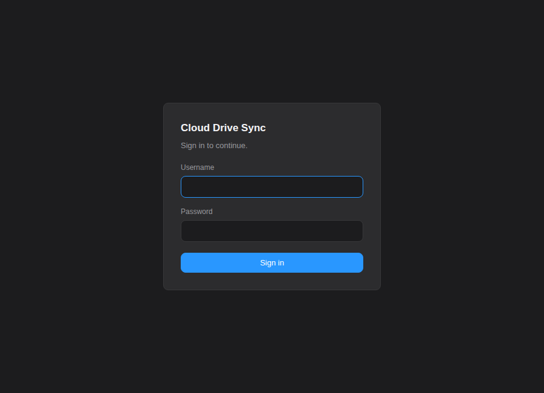

# UI

Desktop application for monitoring and managing Cloud Drive Sync, built with Tauri v2 and React.

## Overview

The UI is a native cross-platform desktop application (Linux, macOS, Windows) that provides:

- Real-time sync status dashboard
- Sync folder pair management
- Conflict resolution interface
- Activity log viewer
- Multi-provider account management (Google Drive, Nextcloud, Dropbox, OneDrive, Box)
- System tray icon with status indicators

## Prerequisites

- **Node.js 18+**
- **Rust toolchain** (install via [rustup](https://rustup.rs/))
- **System libraries** (Linux only — macOS and Windows require no extra dependencies):

  Debian/Ubuntu:
  ```bash
  sudo apt install libwebkit2gtk-4.1-dev libgtk-3-dev libayatana-appindicator3-dev
  ```

  Fedora:
  ```bash
  sudo dnf install webkit2gtk4.1-devel gtk3-devel libayatana-appindicator-gtk3-devel
  ```

## Development

```bash
# Install dependencies
npm install

# Start development server (Vite + Tauri hot-reload)
npm run tauri dev
```

The dev server runs at `http://localhost:1420` with the Tauri window opening automatically.

## Building

```bash
# Build production bundle
npm run tauri build
```

Build artifacts are placed in `src-tauri/target/release/bundle/`:
- **Linux**: `.deb`, `.rpm`, `.appimage`
- **macOS**: `.dmg`
- **Windows**: `.msi`, `.nsis` (NSIS installer)

## Component Overview

| Component | File | Description |
|---|---|---|
| **App** | `src/App.tsx` | Root layout with sidebar navigation, routing, and daemon connection banner. Also hosts **AuthGate**, which resolves who you are before anything else renders |
| **SignIn** | `src/components/SignIn.tsx` | **Web UI only.** The sign-in screen (three views: account, access token, create account) and the change-password form used by Settings. The desktop app never renders it — its transport reports `auth: "none"`, because it reaches the daemon over a Unix socket where the HTTP port's authentication does not apply |
| **SyncStatus** | `src/components/SyncStatus.tsx` | Status dashboard: connection state, file counts, sync/pause controls, daemon info (PID, uptime, version, start time) |
| **Settings** | `src/components/Settings.tsx` | Sync pair management (add/remove), sync mode selector, conflict strategy selector |
| **ConflictDialog** | `src/components/ConflictDialog.tsx` | Lists unresolved conflicts with per-file and batch resolution buttons |
| **ActivityLog** | `src/components/ActivityLog.tsx` | Paginated, filterable activity feed with event type icons. Clicking an entry expands it to show full path, details, account, and timestamp — with a **Copy to clipboard** button. |
| **AccountManager** | `src/components/AccountManager.tsx` | Multi-provider account management: OAuth browser flow (Google Drive, Dropbox, OneDrive, Box) and credential form for Nextcloud (server URL + app password). Each provider has a distinct accent color: Google Drive (blue), Nextcloud (teal), OneDrive (Microsoft blue), Dropbox (light blue), Box (amber), Proton (purple). |
| **About** | `src/components/About.tsx` | App info: version, no-ads/no-tracking pledge, Buy Me a Coffee link, GitHub links |
| **FolderPicker** | `src/components/FolderPicker.tsx` | Local folder selection: native dialog (Tauri) or server-side browser with New Folder creation (HTTP/headless) |
| **RemoteFolderBrowser** | `src/components/RemoteFolderBrowser.tsx` | Hierarchical remote folder browser (works with all providers). Includes breadcrumb navigation, New Folder creation, and an inline sync form where you pick the local destination and **sync mode** (Two-way / Upload only / Download only) before confirming. |
| **RemoteFolderPicker** | `src/components/RemoteFolderPicker.tsx` | Wrapper component that combines the folder browser with selection UI |

### Lib Modules

| Module | File | Description |
|---|---|---|
| **IPC Client** | `src/lib/ipc.ts` | TypeScript wrappers around Tauri `invoke()` for all daemon commands. The `WEB=1` and `DEMO=1` builds alias this module to `ipc-http.ts` / `ipc-demo.ts` — including the `"./lib/ipc"` specifier that `App.tsx` uses, which was missing from the alias map and silently gave the web build the Tauri transport for everything App.tsx calls directly |
| **Types** | `src/lib/types.ts` | Shared TypeScript interfaces (`DaemonStatus`, `SyncPair`, `ConflictRecord`, `LogEntry`) |
| **Hooks** | `src/lib/hooks.ts` | React hooks: `useStatus`, `useSyncPairs`, `useConflicts`, `useActivityLog`, `useDaemonEvent` |

### Rust Backend

| Module | File | Description |
|---|---|---|
| **main** | `src-tauri/src/main.rs` | Tauri app setup, daemon bridge initialization, tray setup, event forwarding |
| **commands** | `src-tauri/src/commands.rs` | Tauri command handlers that proxy calls through the daemon bridge |
| **ipc_bridge** | `src-tauri/src/ipc_bridge.rs` | Unix socket client that connects to the daemon's JSON-RPC server |
| **tray** | `src-tauri/src/tray.rs` | System tray icon and context menu management (uses native APIs on macOS/Windows, appindicator on Linux) |

## Sign-in (web UI only)

`AuthGate` wraps the app *above* the router. That is not a style choice: `NavBar` renders outside `<Routes>` and polls `/api/status` from mount, so a `/login` **route** would draw the whole authenticated chrome around the form and poll itself into a 401 loop behind it.

It resolves `GET /api/auth/session` once, renders a neutral splash while pending, and then either the sign-in screen or the app. Which of the three views appears is the daemon's answer, never a guess in the client:

| `auth` | View |
|---|---|
| `"none"` | None — the app renders immediately. Always the case in the desktop and demo builds |
| `"token"` | Paste the access token, with *Create an account* offered beside it |
| `"user"` | Username and password |

A 401 from any `/api/*` call raises a `cds:session-expired` event, and the gate swaps to the sign-in view in place. It used to be `window.location.href = "/login"`, which discarded whatever the user had typed and could not return them to the route they were on.

Sign out lives in the sidebar footer next to the emergency stop, and only when there is a session to end. Change password is a section in Settings.



## Connecting to the Daemon

The UI automatically connects to the daemon's Unix socket at startup:

1. On launch, the Rust backend attempts to connect to `$XDG_RUNTIME_DIR/cloud-drive-sync/cloud-drive-sync.sock`
2. Connection retries up to 10 times with 3-second intervals
3. On success, the `daemon-connected` event is emitted to the frontend
4. On failure, the `daemon-offline` event is emitted
5. The user can manually reconnect via the `connect_daemon` command

Daemon notifications (sync progress, conflicts, errors) are forwarded as Tauri events and consumed by React hooks.

## Dependencies

### Frontend

| Package | Version | Purpose |
|---|---|---|
| react | ^18.3.0 | UI framework |
| react-dom | ^18.3.0 | React DOM renderer |
| react-router-dom | ^6.20.0 | Client-side routing |
| @tauri-apps/api | ^2.0.0 | Tauri frontend API |
| @tauri-apps/plugin-dialog | ^2.0.0 | Native file/folder dialogs |
| @tauri-apps/plugin-notification | ^2.0.0 | Desktop notifications |
| @tauri-apps/plugin-shell | ^2.0.0 | Shell command execution |

### Dev

| Package | Version | Purpose |
|---|---|---|
| typescript | ^5.3.0 | Type checking |
| vite | ^5.4.0 | Build tool and dev server |
| @vitejs/plugin-react | ^4.2.0 | React support for Vite |
| @tauri-apps/cli | ^2.0.0 | Tauri CLI tools |

### Rust Plugins

| Plugin | Purpose |
|---|---|
| tauri-plugin-shell | Shell command execution |
| tauri-plugin-notification | Desktop notifications |
| tauri-plugin-dialog | Native file dialogs |
